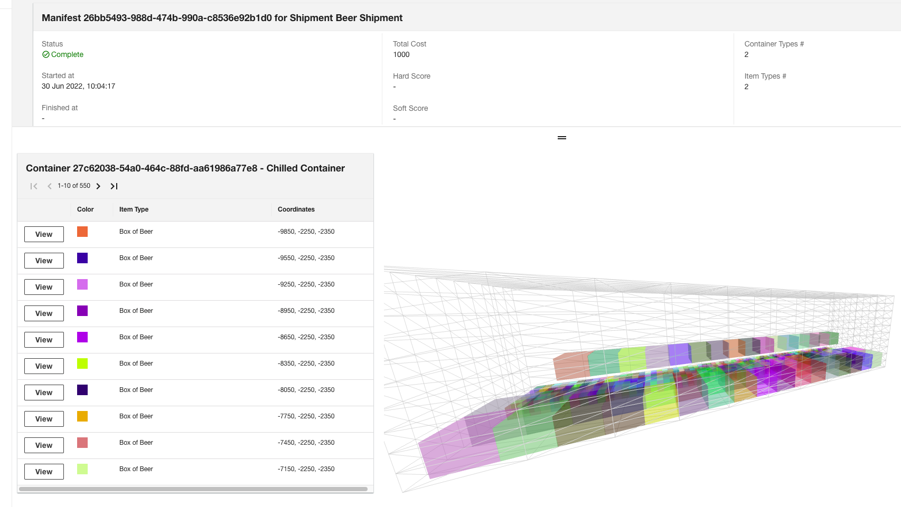
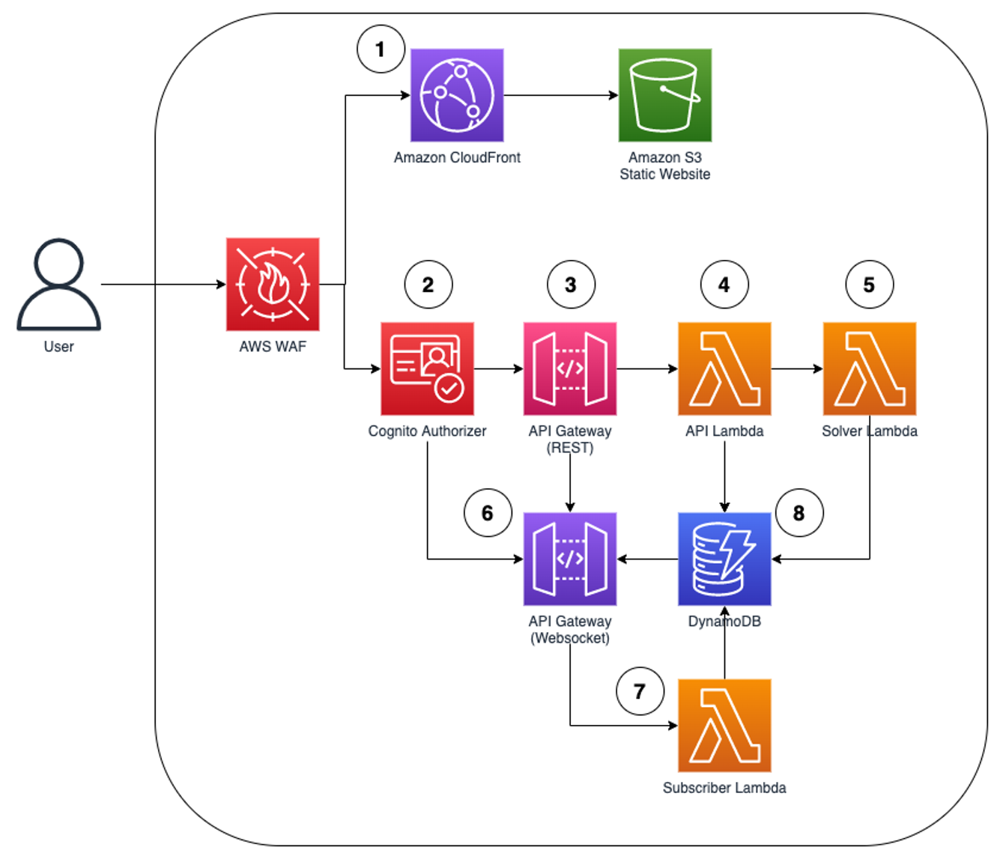

# Bin Packing Solution

The AWS Bin Packing Solution provides you the ability to efficiently pack items into a container in a 3D space.



## Terms

*Container Types*

A container has items that are packed into it. It has dimensions, and can have different features like refrigeration.

*Item Types*

An item type defines items that are packed into containers. Item types have dimensions, and can optionally require the container that it is packed into to have specific features (e.g. refrigeration)

*Shipment*

A shipment defines the items that need to be packed into containers. You can select item types and their quantities to be packed into a quantity of containers.

*Manifest*

One or more manifests are generated for a shipment, which shows which items have been packed into which containers.

## Architecture



1. Single application hosted on Amazon S3 fronted by Amazon CloudFront distribution
2. Amazon Cognito provides authentication and authorization for the APIs
3. API Gateway REST API for handling data model CRUD calls
4. AWS Lambda proxy function performing CRUD, as well as starting the execution of the solver
5. The solver AWS Lamba function runs the packing algorithm to get an optimal solution and writes the results to Amazon DynamoDB. After packing optimisation is done, it looks up the connection ID in Amazon DynamoDB and triggers an update to appropriate WebSocket connection.
6. Bi-directional WebSocket API for handling of asynchronous updates to clients
7. AWS Lambda function links the connection ID of the WebSocket connection with the client metadata
8. Amazon DynamoDB stores data objects, as well as the metadata for websocket connections

## Project Structure

This solution uses 2 languages - C# and TypeScript. The components are:

- Packing Solver (C#) - `application/csharp/AWS.Prototyping.Pacman.Solver/src/AWS.Prototyping.Pacman.Solver`

The packing solver contains the AWS Lambda function that handles the logic of packing items into containers. It is based off an implementation of the EB-AFIT packing algorithm originally developed as a master's thesis project by Erhan Baltacıoğlu (EB) at the U.S. Air Force Institute of Technology (AFIT) in 2001. This algorithm is also described in [The Distributor's Three-Dimensional Pallet-Packing Problem: A Human Intelligence-Based Heuristic Approach, by Erhan Baltacıoğlu, James T. Moore, and Raymond R. Hill Jr.](https://scholar.afit.edu/cgi/viewcontent.cgi?article=5567&context=etd), published in the International Journal of Operational Research in 2006 (volume 1, issue 3).

- Shared Types (TypeScript) - `application/typescript/packages/@aws-prototype/shared-types`

Defines the data model objects that are shared between the API and front-end.

- API (TypeScript) - `application/typescript/packages/@aws-prototype/api`

Implementation of the AWS Lambda proxy function REST API.

- Subscription Handlers (TypeScript) - `application/typescript/packages/@aws-prototype/subscription`

Provides pub/sub handling between DynamoDB and websocket APIs.

- Website - `application/typescript/packages/@aws-prototype/website`

React.js demo front-end.

- Infra - `application/typescript/packages/@aws-prototype/website`

Contains the infrastructure as code required to deploy the solution with AWS CDK.

## Build

### Prerequisites

Ensure the following are installed and present on your PATH:

- `node` (version 14 or above)
- [`.NET 6.0`](https://dotnet.microsoft.com/en-us/download/dotnet/6.0)
- `yarn`
- `npx`
- `Docker`
- [`AWS CLI`](https://aws.amazon.com/cli/)
- [`AWS CDK`](https://docs.aws.amazon.com/cdk/v2/guide/home.html)
- `cfn-nag` (`gem install cfn-nag`)

### Build Instructions Complete Build

1) Navigate to `application/csharp/AWS.Prototyping.Pacman.Solver/src/AWS.Prototyping.Pacman.Solver` and run `docker build .`

2) Navigate to `application/typescript` and run: `yarn run build`.

This will install the dependencies and build all packages in dependency order.

## Bootstrapping new accounts

Be sure to run this command before planning to deploy to target accounts:

```cdk bootstrap --profile <target account profile> --trust <pipeline account id> --cloudformation-execution-policies arn:aws:iam::aws:policy/AdministratorAccess```

## Configuration

### Pipeline Notifications

By creating a `notifications.json` file in the root directory of this repository, you can configure slack notifications for the CICD pipeline, eg:

```json
{
  "slackChannelConfigurationName":"my-cicd-notifications",
  "slackWorkspaceId":"TXXXXXXXXXX",
  "slackChannelId":"CXXXXXXXXXX"
}
```

## Deployment

First, ensure you have followed the [AWS CDK prerequisites](https://docs.aws.amazon.com/cdk/v2/guide/getting_started.html) before starting deployment.

Navigate to `application/typescript/packages/@aws-prototype/infra` and run `cdk deploy`.